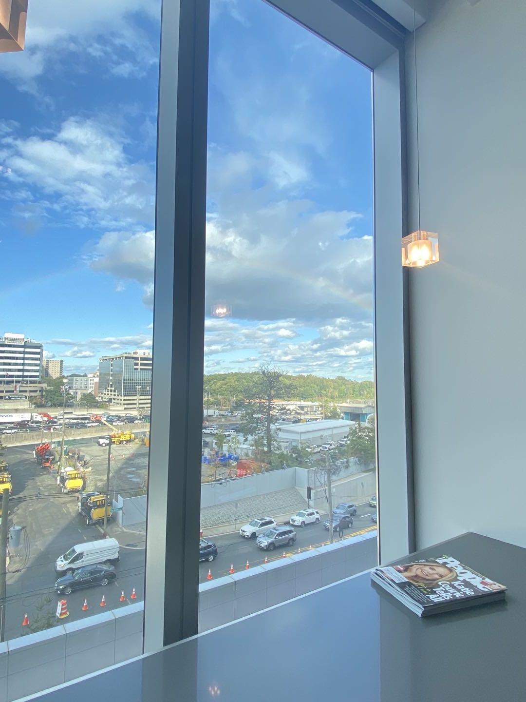

##    Introduction

My name is Guiqi Cai. And  I go by Nicole. I currently study at Columbia University Mailman School of Public Health; I major in Epidemiology. I enjoy reading, cooking, and traveling. This page will provide you with information about my interest, academic and professional experience. I will also share a piece of work that I work on for my P8105 data science class.

##  Photos
### Here are few of my favorite things:)

## *Links*
### Link to my resume

[Resume](Resume.html)

### Link to my work

[Dashboard](dashboard.html)

